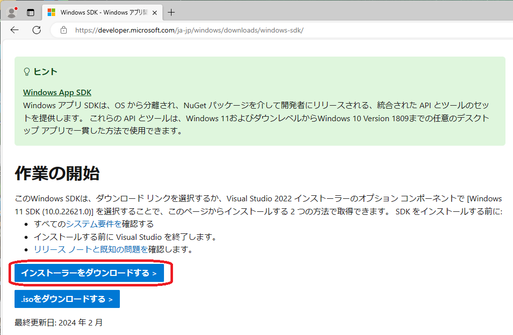
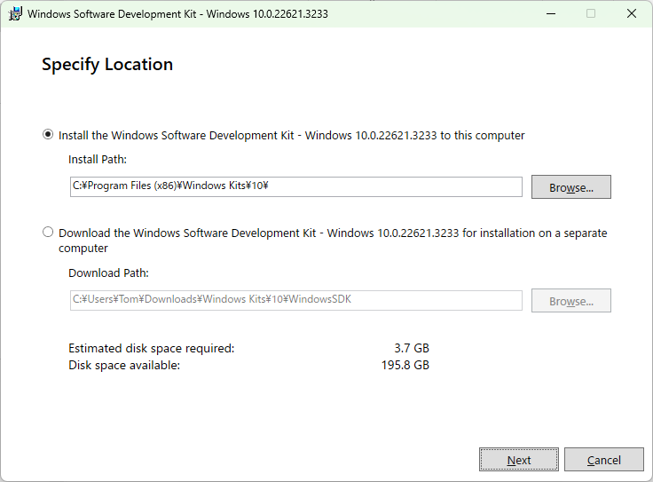
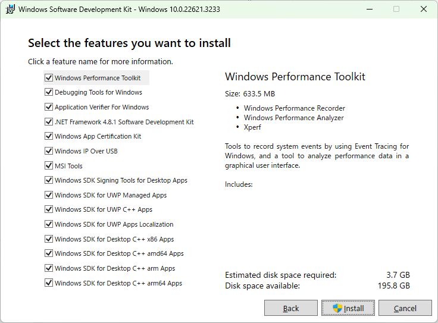
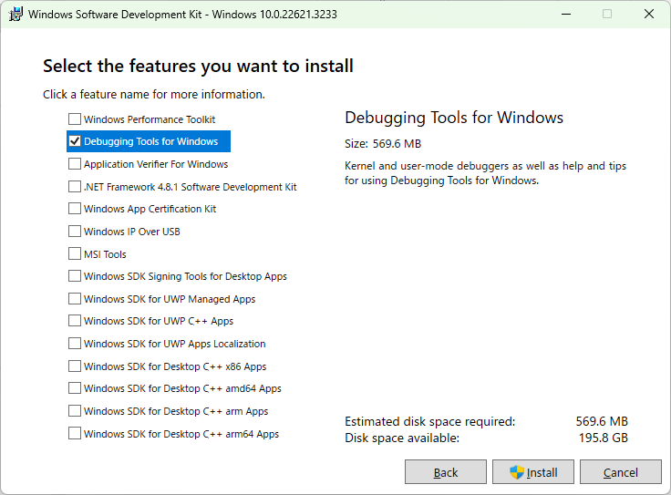
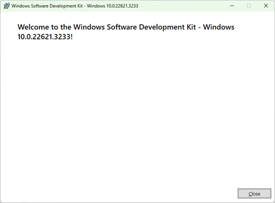
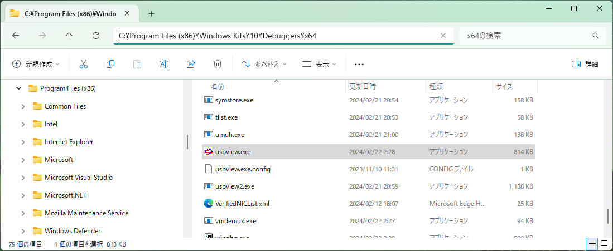
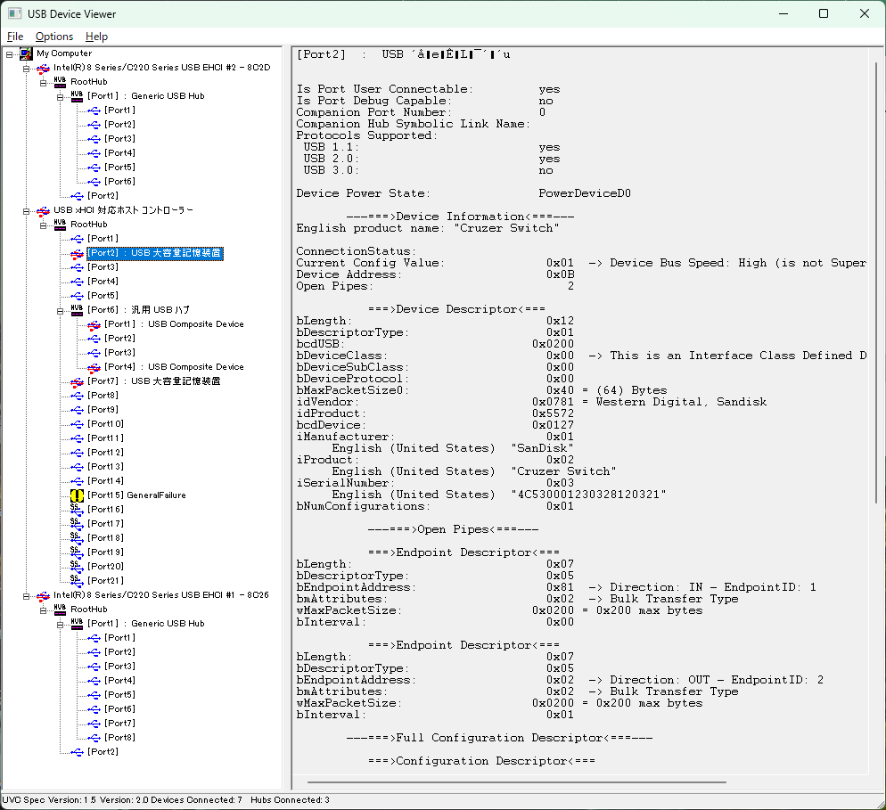
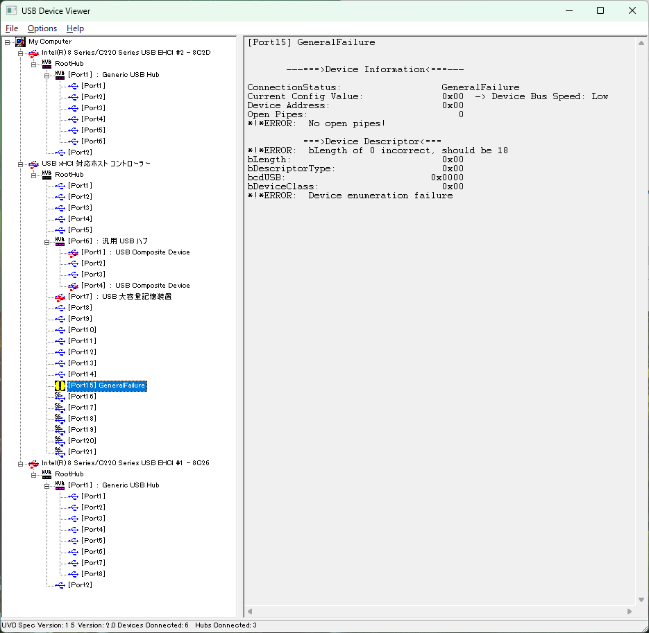

# USBView-docs

**Windows のユニバーサル シリアル バス ビューアー** のインストール方法と使い方

[English version](README_en.md)

Windows の USB ハードウェアがらみのトラブルを見極める手段として、開発者向けのツールとして有名な USBView があります。誰でも容易に使えるツールですが、インストール手順が少しだけ面倒なので紹介します。

## インストールの概要

次の「[Windows のユニバーサル シリアル バス ビューアー](https://learn.microsoft.com/ja-jp/windows-hardware/drivers/debugger/usbview)」手順を実行します。

https://learn.microsoft.com/ja-jp/windows-hardware/drivers/debugger/usbview

1. Windows SDK をダウンロードしてインストールを開始します。

2. インストール時に、 [Debugging Tools for Windows] ボックスのみを選択して、それ以外のすべてのボックスの選択を解除します。

3. SDK により、USBView は、x64 PC では既定で次のディレクトリにインストールされます。

    C:\Program Files (x86)\Windows Kits\10\Debuggers\x64

4. 実行中のアーキテクチャに合わせた kits デバッガー ディレクトリを開き、**usbview.exe** を選択して起動します。

## Windows SDK のダウンロード

https://developer.microsoft.com/ja-jp/windows/downloads/windows-sdk/ のページでWindows SDK インストーラー winsdksetup.exe をダウンロードして起動し、インストールを開始します。

### Windows SDK インストーラーの起動

ダウンロードした、winsdksetup.exe を起動すると次の画面が表示されるので、そのまま「Next」でインストールを開始します。「Download the Windows Software Development kit - ... 」は、別のPC等へのオフラインインストーラをダウンロードする場合に選択します。

### SDK インストール項目の選択

インストール機能の選択画面です。デフォルトでは全ての機能が有効です。

### **Debugging Tools for Windows** だけを残す選択

上から2番目の「Debugging Tools for Windows」だけを残して、他の選択を外して「インストール」をクリックします。他の項目を選択して残す事も可能ですが、Visual Studio をインストールしないと利用できない場合があります。

### インストール完了

しばらく経つとインストールが完了して「Welcome」メッセージが表示されます。「Close」ボタンで閉じます。

### インストールの確認

この手順でインストールした場合、x64版実行モジュールのインストール先は、**C:\Program Files (x86)\Windows Kits\10\Debuggers\x64\usbview.exe** となります。

### USBView の起動

usbview.exe を起動した場合の表示例です。
USBの各デバイスはこの様にUSB Hub を介してツリー構造で配置されます。
目的のデバイスの情報は目印となるUSBメモリーを抜き差しする等して接続点、物理ソケットとの対応を確認します。

正常なUSBデバイスをクリックして表示させると、デバイス情報、デバイスディスクリプターとエンドポイントの情報などを確認することが可能です。

### 問題があるターゲットデバイス

次に示す様に、問題があるUSBターゲットデバイスが接続している場合は、黄色「!」マークで強調表示されます。

### USBView ソース コード

USBView は、GitHub の Windows ドライバー サンプル リポジトリでも入手できます。

https://github.com/microsoft/Windows-driver-samples/tree/main/usb/usbview

以上。