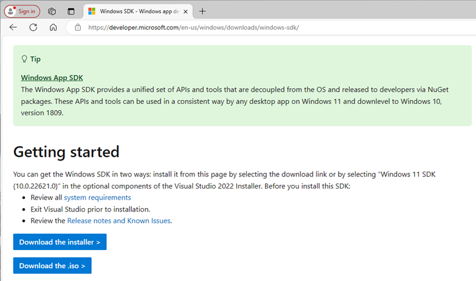
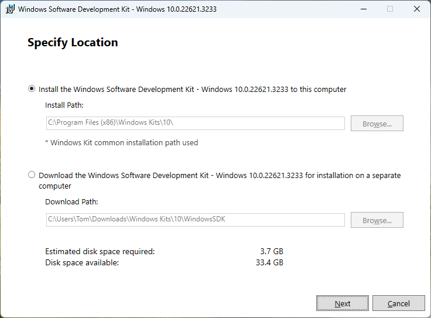
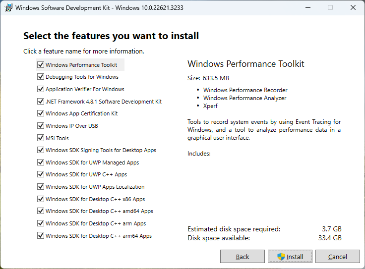
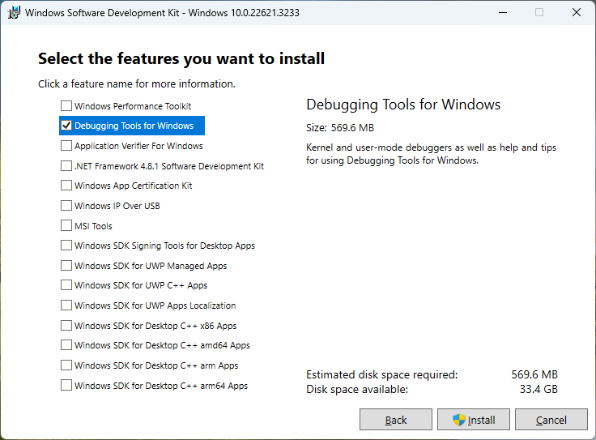
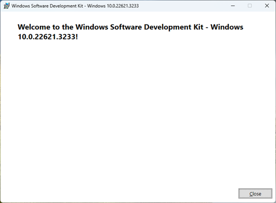
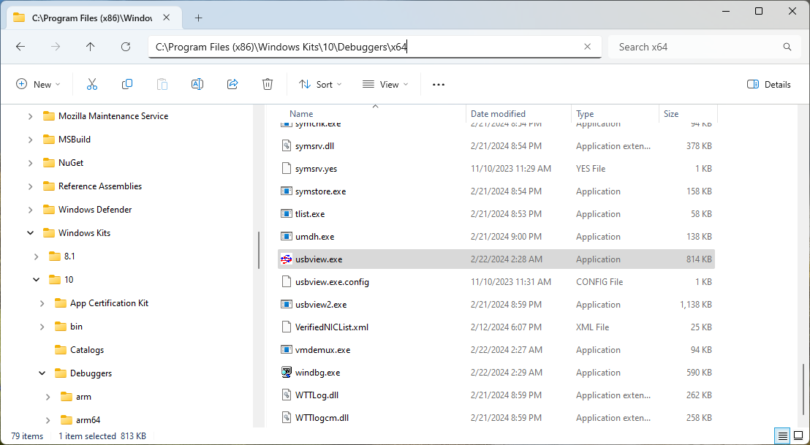
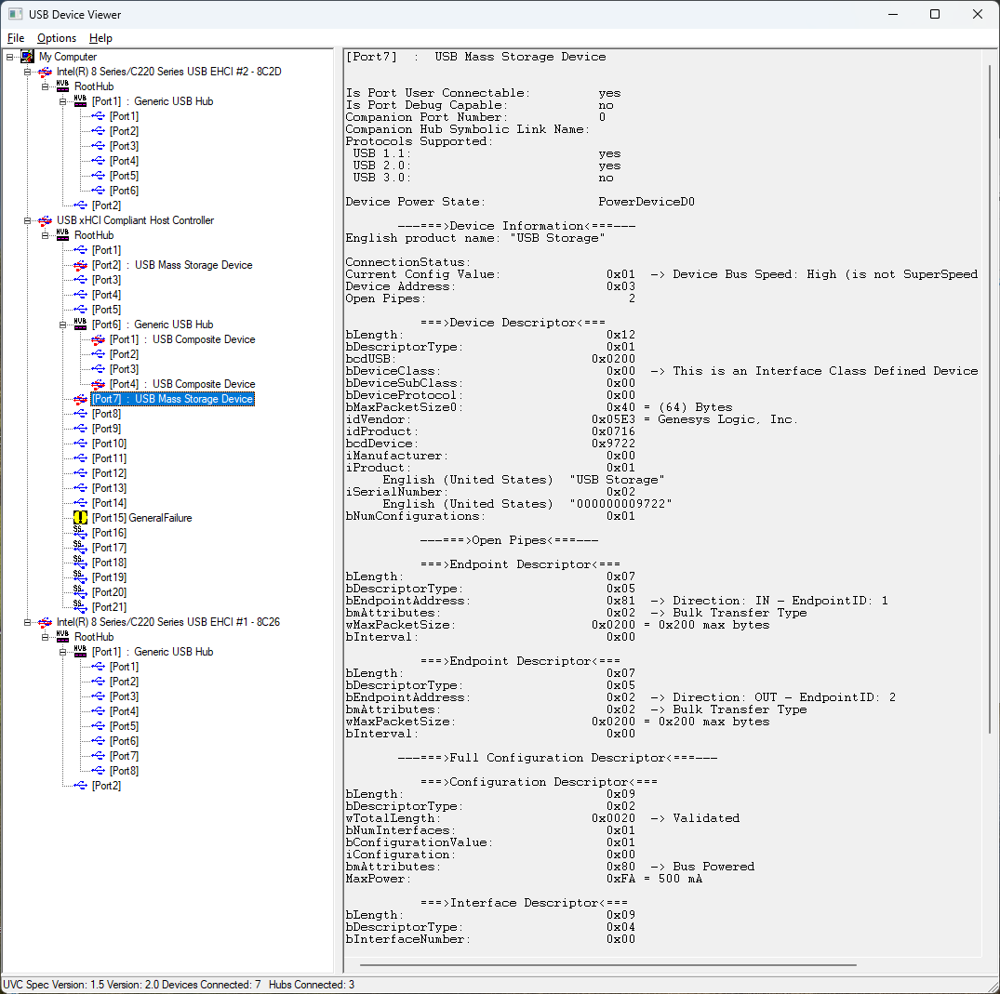
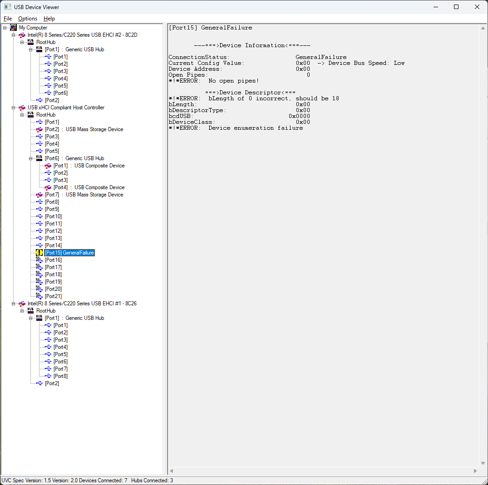

# USBView-docs

**Windows のユニバーサル シリアル バス ビューアー** のインストール方法と使い方

[Japanese version](README.md)

Please refer to the link below for details on what is written here.

https://learn.microsoft.com/ja-jp/windows-hardware/drivers/debugger/usbview

##

インストール時に、 [Debugging Tools for Windows] ボックスのみを選択して、それ以外のすべてのボックスの選択を解除します。

SDK により、USBView は、x64 PC では既定で次のディレクトリにインストールされます。

C:\Program Files (x86)\Windows Kits\10\Debuggers\x64

実行中のプロセッサの種類の kits デバッガー ディレクトリを開き、[usbview.exe] を選択してユーティリティを起動します。

USBView ソース コード

USBView は、GitHub の Windows ドライバー サンプル リポジトリでも入手できます。

##

https://developer.microsoft.com/ja-jp/windows/downloads/windows-sdk/ のページでWindows SDK インストーラー winsdksetup.exe をダウンロードして起動し、インストールを開始します。

winsdksetup.exe を起動すると次の画面が表示されるので、そのまま「Next」でインストールを開始します。下の選択は別のPC等へのオフラインインストーラをダウンロードする場合に選択します。

インストール機能の選択画面です。デフォルトでは全ての機能が有効です。

上から2番目の「Debugging Tools for Windows」だけを残して、他のチャックを外して「インストール」をクリックします。

しばらく経つとインストールが完了して「Welcome」メッセージが表示されます。「Close」ボタンで閉じます。

この手順でインストールした場合、x64版実行モジュールのインストール先は、
C:\Program Files (x86)\Windows Kits\10\Debuggers\x64\usbview.exe となります。

そのまま usbview.exe を起動した場合の表示例です。
この様に 問題があるUSBデバイスが接続している場合は、黄色「!」マークで強調表示されます。

正常なUSBデバイスをクリックして表示させると、デバイス情報、デバイスディスクリプターとエンドポイントの情報などを確認することが可能です。

USBの各デバイスはこの様にUSB Hub を介してツリー構造で配置されます。
目的のデバイスの情報は目印となるUSBメモリーを抜き差しする等して接続点、物理ソケットとの対応を確認します。

以上。